# Informe Técnico - TP5: Protocolo Serie con Framing y Checksum sobre UART

**Alumno:** Maximiliano Lopez

**Materia:** Sistemas Embebidos

**Institución:** Universidad Argentina de la Empresa (UADE)

---

# 1. Introducción y Objetivo

El objetivo de este trabajo práctico es diseñar, implementar y validar un protocolo de comunicación serie asíncrono utilizando el periférico USART1 del microcontrolador STM32F103 (Blue Pill), basado en la biblioteca `libopencm3`.

La aplicación tiene como fin establecer un canal robusto, inmune al ruido y con verificación de integridad de datos entre una computadora de control (utilizando la terminal serie PuTTY) y el firmware embebido.

Para lograrlo, se estructuró el sistema sobre un diseño basado en capas:

* **Capa Física/Enlace (UART):**
  Configuración nativa del periférico a alta velocidad (115200 bps).

* **Capa de Protocolo:**
  Implementación de tramas con delimitadores de inicio y fin (`@`, `\n`) y cálculo de redundancia mediante Checksum XOR de 8 bits.

* **Capa de Aplicación (FSM + MVP de buzones):**
  Implementación de una Máquina de Estados Finitos (FSM) incremental encargada de consumir bytes en tiempo real. Esta capa despacha los comandos exigidos por la cátedra (`ping`, `led`, `status?`) y además fue integrada con un MVP de Sistema de Buzones Electrónicos, incorporando el comando personalizado `SET` para colocar el pin necesario para desbloquear los buzones, los cuales se van a desbloquear presionando botones en la secuencia correcta.

---

# 2. Esquema de Conexión

La interconexión de las señales de comunicación y control se realizó integrando los requisitos del protocolo serie y el hardware del MVP de buzones.

| Periférico / Señal | Pin Blue Pill | Hardware         | Propósito                          |
| ------------------ | ------------- | ---------------- | ---------------------------------- |
| USART1_TX          | PA9           | RXD USB-TTL      | Transmisión hacia la PC            |
| USART1_RX          | PA10          | TXD USB-TTL      | Recepción desde la PC              |
| Botones MVP        | PA0-PA4       | Pulsadores a GND | Ingreso físico del PIN             |
| PWM Buzones        | PB0 / PB1     | LEDs             | PWM variable                       |
| Buzones Digitales  | PB10-PB12     | LEDs             | Salidas Push-Pull                  |
| Feedback MVP       | PB13 / PB14   | Buzzer + LED     | Confirmación local                 |
| ADC                | PA7           | Potenciometro    | Variar el PWM de los leds PB0 y PB1|
| GND                | GND           | USB-TTL GND      | Referencia común                   |
| LED Integrado      | PC13          | Interno          | Encender con el comando led=on     |

---

## Evidencia Fotográfica

En la proxima imagen se pretende ilustrar el montaje fisico en el protoboard del proyecto

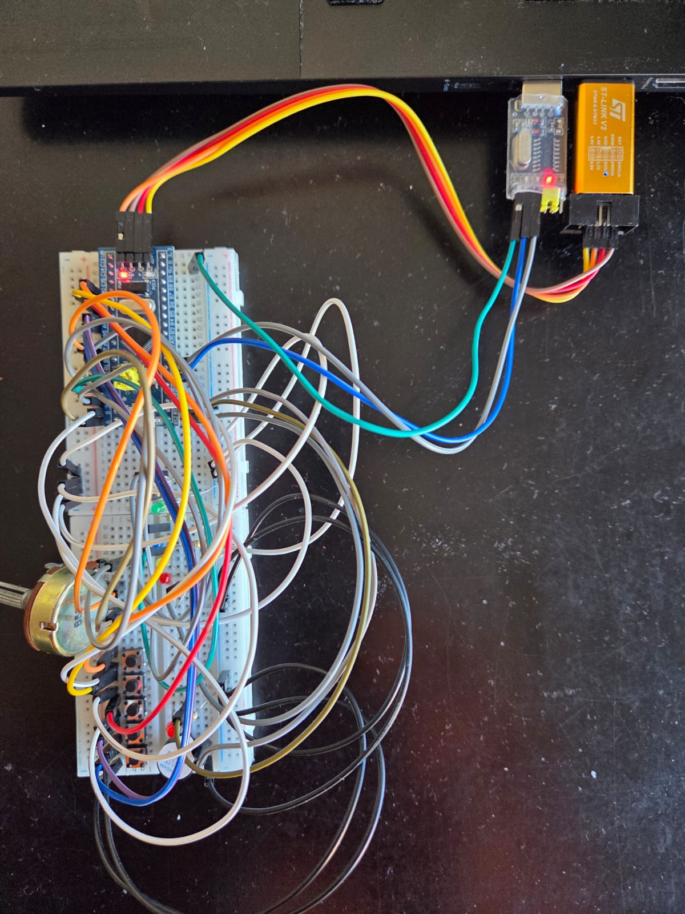

Debido a la poca visibilidad de las conexiones ocasionado por el gran numero de cables, tambien se adjunta un modelado digital de las conexiones hecho con wokwi a traves del file `diagram.json`, con el cual se puede reconstruir el circuito en la pagina de wokwi para revisar las conexiones

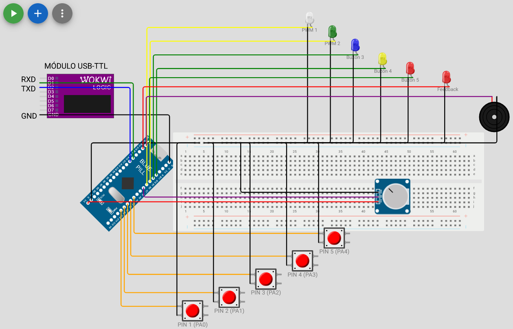
---

# 3. Etapa 1: Capa de Enlace y Configuración UART

Se configuró USART1 para operar de forma asíncrona a:

* 115200 baudios.
* 8 bits de datos.
* Sin paridad.
* 1 bit de parada.
* Sin control de flujo.

---

### RXNE, TXE y TC

### RXNE

**Receive Data Register Not Empty.**

Este flag es activado cuando el hardware recibe un byte completo y lo transfiere al registro USART_DR.

El firmware monitorea este flag mediante polling y ejecuta la FSM del parser cuando detecta un nuevo dato.

Se limpia automáticamente al leer USART_DR mediante:

```c
usart_recv();
```

---

### TXE

**Transmit Data Register Empty.**

Indica que USART_DR está disponible para aceptar un nuevo byte desde software.

No implica que el byte ya salió físicamente por el pin TX.

---

### TC

**Transmission Complete.**

Se activa únicamente cuando:

* USART_DR está vacío.
* El registro de desplazamiento terminó completamente la transmisión física.

---

## ¿Qué configuración requieren PA9 y PA10?

### PA9 (TX)

Debe configurarse como:

```c
GPIO_CNF_OUTPUT_ALTFN_PUSHPULL
```

Esto permite que el periférico USART tome el control eléctrico del pin.

---

### PA10 (RX)

Se configura como:

```c
GPIO_CNF_INPUT_FLOAT
```

El módulo USB-TTL mantiene la línea en estado Idle alto.

---

# 4. Etapa 2: Implementación del Protocolo y Parser FSM

El protocolo implementado utiliza el formato:

```
@LL:TTT:PAYLOAD:CC\n
```

La interpretación se realiza mediante una FSM incremental de nueve estados que procesa un carácter por iteración.

---

### ¿Por qué usar una FSM incremental?

Las funciones bloqueantes como `strcmp()` requieren almacenar primero la trama completa.

Esto presenta varios inconvenientes:

* Mayor uso de RAM.
* Posibles overflows.
* Procesamiento tardío.
* Mala recuperación ante ruido.

El parser incremental analiza byte a byte.

Ante cualquier error:

* Descarta la recepción.
* Limpia el estado interno.
* Resincroniza automáticamente.

Todo esto sin bloquear el procesador.

El almacenamiento previo en buffer de líneas completas (mediante funciones tipo fgets o acumulando caracteres hasta un \n para luego aplicar sscanf/strcmp) asume un canal de comunicación ideal. En sistemas embebidos reales, esto es sumamente peligroso porque delega el control de la memoria RAM al ruido físico de la línea.

Dos situaciones concretas donde una lectura por línea fallaría catastróficamente son:

* Caso A: Inyección de Ruido Sostenido (Denegación de Servicio y Overflow). Si el cable de recepción (RX) capta interferencia electromagnética de un motor, un relé o acoplamiento capacitivo, la UART puede empezar a recibir ráfagas interminables de bytes espurios (ruido) sin que jamás llegue un carácter de fin de línea (\n). Un lector por línea acumularía estos bytes de forma indefinida hasta desbordar el buffer asignado en la RAM (Buffer Overflow), corrompiendo variables críticas del sistema o colgando el microcontrolador. El parser incremental, en cambio, limita estrictamente la cantidad de bytes por estado (gracias a p->body_len) y descarta la trama inmediatamente si excede el tamaño máximo (PROTOCOL_MAX_BODY_SIZE), reseteando el buffer de forma segura.

* Caso B: Pérdida o Corrupción del Delimitador de Fin (\n). Si debido a un glitch eléctrico el byte \n de una trama válida se corrompe y se transforma en otro carácter (por ejemplo, un 0x20), el lector por línea no se enteraría. Seguiría esperando el \n real y pegaría la siguiente trama entrante en el mismo buffer. Al final, cuando llegue un \n, el buffer contendrá dos tramas fusionadas (ej: @08:CMD:ping:52 @0A:CMD:led=on:6A\n). Al pasarle un strcmp, la validación fallará por completo y se perderán ambos comandos. El parser incremental detecta el error de formato mucho antes (en el estado EXPECT_END al no hallar el \n), descarta solo la primera y se prepara al instante para procesar la segunda de forma limpia.

---

## Diagnóstico con PuTTY

Durante las pruebas se observó que PuTTY transmite cada carácter inmediatamente.

Para verificar la recepción se implementó:

```c
if (byte == '\r') {
    usart_send_blocking(USART1, '\r');
    usart_send_blocking(USART1, '\n');
} else {
    usart_send_blocking(USART1, byte);
}
```

Este bloque permitió confirmar:

* Correcta recepción física.
* Ausencia de errores eléctricos.

Algo a destacar es que la trama se ejecuta al presionar ctrl + j, y no cuando se presiona enter. Por lo que para el correcto envio de la trama desde putty a la blue pill se debe presionar ctrl + j, en futuras versiones se espera corregir esto para poder enviar la trama simplemente presionando enter, lo cual es mucho mas comodo e intuitivo para el usuario

---

## ¿Que pasaria si se ignorara el \r?
Si el carácter \r (Carriage Return) se procesara como un byte normal, causaría fallas críticas de sincronismo y saltos al estado de error dependiendo de dónde se lo envíe. El fallo más inmediato ocurriría en el estado PARSER_STATE_EXPECT_END.

¿Por qué causaría un error?
Cuando una terminal como PuTTY envía un salto de línea al presionar Enter, usualmente transmite la secuencia clásica \r\n (0x0D, 0x0A).

Al recibir el Checksum, la FSM pasa al estado PARSER_STATE_EXPECT_END.

Si \r no fuera ignorado, la máquina de estados evaluaría el byte 0x0D en la siguiente línea de código:

```
case PARSER_STATE_EXPECT_END:
if (byte == '\n') {  // Como byte == '\r' (0x0D), esta condición da FALSO
// ... lógica de éxito ...
}
goto error; // Al dar falso, se ejecuta el goto error de manera directa
```

Al saltar a la etiqueta error:, el parser incrementaría pe_count, ejecutaría parser_init(p) borrando todo lo que costó procesar y descartaría la trama entera justo antes de validar el Checksum.

Además, si el \r se colara en el estado PARSER_STATE_READ_BODY, sería guardado dentro de p->body_buf como parte del payload. Esto alteraría el largo real del cuerpo y haría que el cálculo matemático del Checksum XOR falle al final de la trama.

## ¿Se pueden pasar dos tramas pegadas?
Sí, el parser entrega la segunda trama de manera 100% correcta y consecutiva. Esto funciona sin necesidad de delays gracias al diseño no bloqueante del parser y a la arquitectura de limpieza inmediata que aplicás al procesar un mensaje válido.

Cuando el último byte de la primera trama (\n) ingresa a parser_consume_byte, la FSM se encuentra en el estado PARSER_STATE_EXPECT_END. Al verificar que byte == '\n', se ejecuta la validación del Checksum y se extraen los campos. Inmediatamente antes de retornar PARSER_RESULT_MESSAGE_READY, tu código ejecuta de forma obligatoria la función parser_init(p).

Esto provoca que el estado del parser regrese instantáneamente a PARSER_STATE_WAIT_START y limpie todos los índices internos (body_pos = 0, etc.).

Cuando el siguiente byte del flujo de la UART (que es el @ de la segunda trama) ingresa inmediatamente en el próximo ciclo del lazo while(1), encuentra al parser perfectamente limpio y listo en su estado inicial.
Traza de estados detallada para la segunda trama:


| Byte recibido | Estado actual de la FSM | Acción interna / transición |
|--------------|-------------------------|-----------------------------|
| (Inicio) | `PARSER_STATE_WAIT_START` | El parser ya fue reseteado por la trama anterior. |
| `'@'` | `PARSER_STATE_WAIT_START` | Detecta la cabecera. Ejecuta `parser_init()` y pasa a `READ_LEN_HI`. |
| `'0'` | `PARSER_STATE_READ_LEN_HI` | Convierte `'0'` a nibble (`0x00`) y pasa a `READ_LEN_LO`. |
| `'A'` | `PARSER_STATE_READ_LEN_LO` | Convierte `'A'` a nibble (`0x0A`), calcula `body_len = 0x0A` (10 bytes) y pasa a `EXPECT_LEN_SEPARATOR`. |
| `':'` | `PARSER_STATE_EXPECT_LEN_SEPARATOR` | Valida el separador y pasa a `READ_BODY`. |
| `'C','M','D',...` | `PARSER_STATE_READ_BODY` | Almacena los caracteres en `body_buf` hasta que `body_pos == 10` (`"CMD:led=on"`). Luego pasa a `EXPECT_CHECK_SEPARATOR`. |
| `':'` | `PARSER_STATE_EXPECT_CHECK_SEPARATOR` | Valida el separador del checksum y pasa a `READ_CHECK_HI`. |
| `'6'` | `PARSER_STATE_READ_CHECK_HI` | Convierte `'6'` (`0x60`) y pasa a `READ_CHECK_LO`. |
| `'A'` | `PARSER_STATE_READ_CHECK_LO` | Convierte `'A'` (`0x0A`), forma `check_expected = 0x6A` y pasa a `EXPECT_END`. |
| `'\n'` | `PARSER_STATE_EXPECT_END` | Detecta el fin de trama y valida el checksum XOR de `"0A:CMD:led=on"` contra `0x6A`. |
| Fin de procesamiento | `PARSER_STATE_EXPECT_END` | El checksum es válido, ejecuta `parser_init()` y retorna `PARSER_RESULT_MESSAGE_READY`. |


---

# 5. Etapa 3: Despacho de Comandos e Integración MVP

Luego de validar correctamente una trama y su checksum, la FSM ejecuta:

```c
app_handle_message();
```

Se implementaron:

* ping
* led=on
* led=off
* led=toggle
* status?

Y además se extendió el protocolo con el comando:

```
SET
```

---

## 5.1 Extensión del protocolo: SET

Formato:

```
@08:SET:XXXX:CC\n
```

Donde:

* XXXX = PIN de cuatro dígitos.
* CC = Checksum XOR.

Funcionamiento:

* Verifica longitud.
* Busca buzón libre.
* Guarda el PIN.
* Marca el buzón ocupado.
* Emite feedback local.
* Responde:

```
ACK:assigned_buzon=N
```

Si todos están ocupados:

```
ERR:code=all_mailboxes_full
```

Ademas, se incorporó un mensaje para que el usuario sepa cuando se libera un buzon

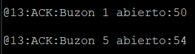

---

## 5.2 Comando status?

Al recibir:

```
@0B:CMD:status?:13\n
```

Se responde:

```
STS:rx=N,ae=N,irq=N,pb=N,pm=N,pe=N,qd=N
```

Donde:

| Campo | Significado           |
| ----- | --------------------- |
| rx    | comandos procesados   |
| ae    | errores de aplicación |
| irq   | bytes recibidos       |
| pb    | bytes procesados      |
| pm    | mensajes válidos      |
| pe    | errores del parser    |
| qd    | bytes descartados     |

---

## 5.3 Resincronización

Caso:

```
@0@08:CMD:ping:52\n
```

La FSM:

1. Detecta error.
2. Incrementa pe.
3. Reinicia el parser.
4. Reutiliza el segundo '@'.
5. Procesa correctamente:

```
08:CMD:ping:52\n
```

---

# Evidencias de Terminal

## A. Bienvenida y PING

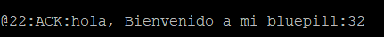
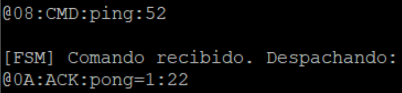

---

## B. SET

```
@08:SET:1111:4A
@08:SET:2222:4A
```
Es mas sencillo cuando el codigo es todos numeros iguales porque el checksum es siempre 4A, el usuario debe calcular él mismo el checksum para colocarlo al final de la trama.

Sin embargo colocar una trama al estilo @08:SET:1234:1D es totalmente valido, siempre y cuando el checksum sea el adecuado o devolverá que hubo un error en la trama

Respuesta:

```
ACK:assigned_buzon=n
```
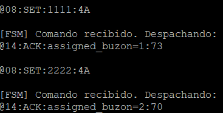
---

## C. STATUS

```
@0B:CMD:status?:13
```

Respuesta:

```
STS:rx=...,ae=...,...
```
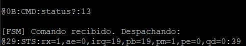
---

## D. Comando correcto con basura antes

A pesar de pasarle basura previo al @ la bluepill interpretó bien el comando que se le estaba enviando

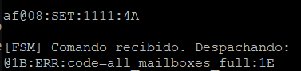

## E. LED y ERRORES

Con el siguiente comando el led se enciende
```
@0A:CMD:led=on:6A
```
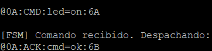

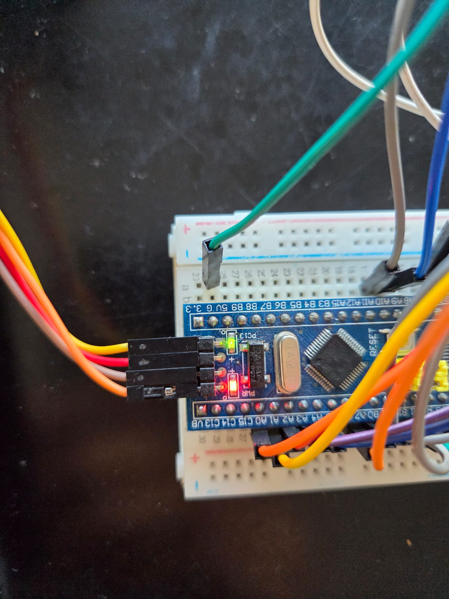

Mientras que con el siguiente comando el led se apaga
```
@0A:CMD:led=off:07
```

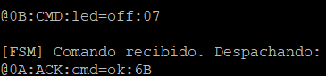

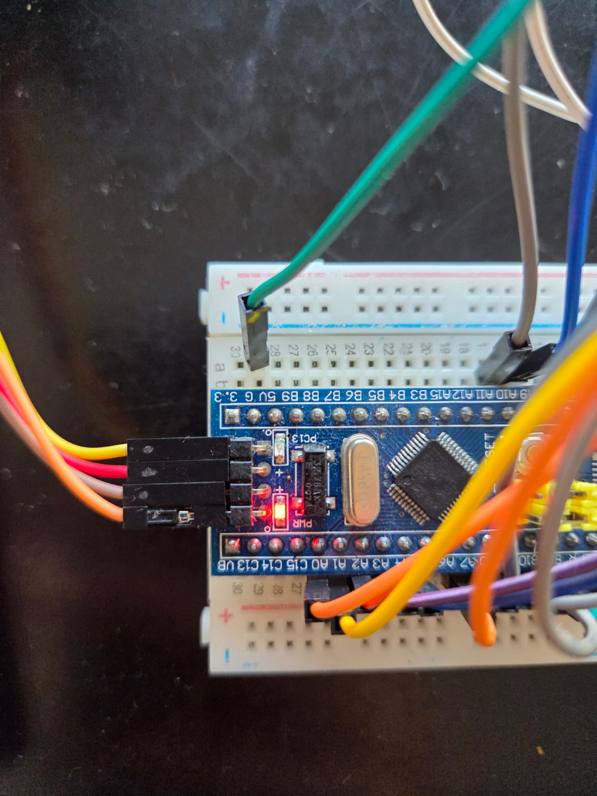

En caso de haber un error en el comando se recibirá un comando de error
```
@08:SET:5555:18
```
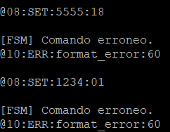
---

## Evidencia Fotográfica del buzon con PWM

El led encendido al minimo despues de bajar el potenciometro

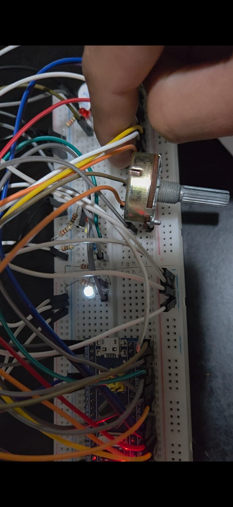

Se incrementó la potencia del potenciometro

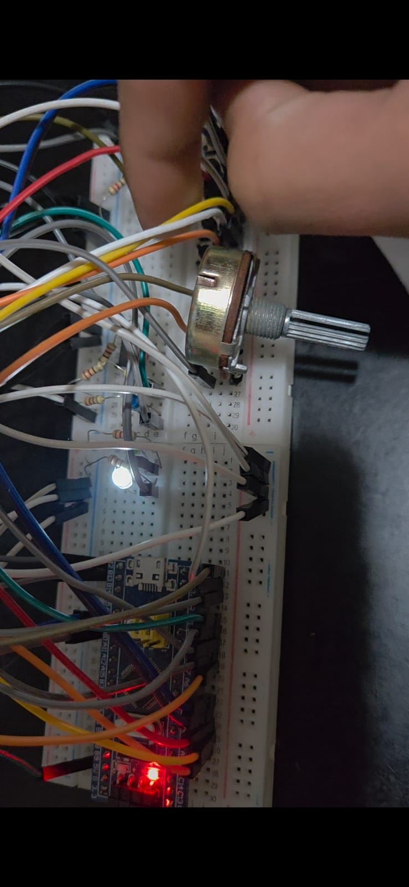

Finalmente se llevó el potenciometro al maximo

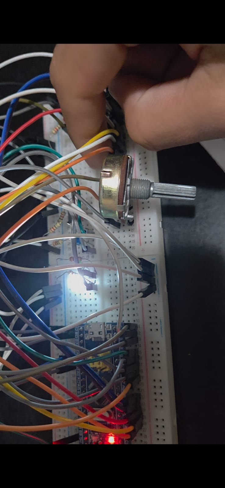

La diferencia es mas notable entre el minimo y el maximo, el del medio no se llega a apreciar tanto la diferencia con el minimo debido a que el potenciometro en el minimo podria haberse llevado mas al minimo aun.

---

# 6. Tabla de Configuración de Periféricos

| Periférico   | API                 | Configuración  | Justificación             |
| ------------ | ------------------- | -------------- | ------------------------- |
| USART1       | usart_set_baudrate  | 115200 8N1     | Alta velocidad            |
| USART1       | usart_set_parity    | NONE           | Checksum en capa superior |
| ADC1         | adc_set_sample_time | 239.5 ciclos   | Lectura estable           |
| TIM3         | timer_set_oc_mode   | PWM1           | PWM buzones               |
| GPIO PA9     | gpio_set_mode       | ALTFN_PUSHPULL | UART TX                   |
| GPIO PA0-PA4 | gpio_set_mode       | INPUT_PULLUP   | Botones MVP               |

---

# 7. Conclusiones

## 7.1. Diagnóstico de Capa Física y Mitigación de Terminales (El Porqué del Eco UART)

El trabajo con la terminal PuTTY desmitificó el funcionamiento de los flujos de texto en consolas serie en tiempo real. Al notar que la terminal transmite de forma asíncrona e individual cada carácter sin reflejar un eco de lo que estaba recibiendo la bluepill para corroborar que toda la trama estuviera llegando como corresponde. Para resolver esto, se implementó un bloque de eco explícito en el firmware: cada byte recibido por la UART fue retransmitido inmediatamente de vuelta al host.

Esta técnica de diagnóstico fue fundamental por dos razones de ingeniería: primero, sirvió como prueba de bucle (loopback) por software para verificar de manera instantánea la integridad eléctrica de las líneas RX y TX; segundo, forzó la comprensión de la secuencia de bytes de control de fin de línea (\r y \n), permitiendo destrabar el aparente bloqueo del parser mediante la inyección del salto de línea físico (o su comando Ctrl + J) sin alterar el procesamiento sintáctico de la máquina de estados.

## 7.2. Depuración Avanzada con GDB frente al Tiempo Real

El uso del depurador GDB (GNU Debugger) integrado con la interfaz St-Link marcó un punto de inflexión en la resolución de errores lógicos complejos. GDB demostró ser una herramienta invaluable para inspeccionar la memoria RAM en vivo, permitiendo colocar puntos de interrupción (breakpoints) y verificar paso a paso cómo transitaba la FSM interna (p->state) y cómo se convertían los caracteres hexadecimales a valores numéricos dentro de las funciones de conversión de nibbles.

Sin embargo, esta etapa expuso un contraste crítico entre la depuración estática y la dinámica de hardware: al pausar el núcleo del procesador con GDB para analizar una variable, el flujo asíncrono de la UART externa continuaba operando en el mundo físico. Al reanudar la ejecución, se evidenciaron fenómenos como el Overrun Error (ORE), donde los nuevos bytes entrantes pisaban a los anteriores por no haber sido retirados a tiempo de los registros de lectura. Este comportamiento reforzó la regla de diseño de escribir rutinas de interrupción extremadamente veloces y optimizadas.

## 7.3. Domado del Hardware y Estabilización de Señales

A nivel eléctrico, la experimentacion obligó a interactuar con las restricciones reales del circuito. Uno de los mayores desafíos fue el control del "efecto antena" (pin flotante) experimentado al cablear el panel de botones del MVP. El ruido electromagnético ambiental, magnificado por los jumpers largos en la disposición de doble breadboard, inundaba el sistema con flancos de tensión aleatorios que corrompían las lecturas. La aplicación de conceptos de firmware correctivo, configurando las resistencias internas de Pull-Up y Pull-Down del STM32F103 mediante la API de libopencm3, eliminó de raíz el problema sin requerir hardware adicional, garantizando la estabilidad de las entradas digitales de los buzones.

## 7.4. Integración Multitarea y Valor Agregado del MVP

El aspecto más enriquecedor y de mayor valor agregado del proyecto fue fusionar el protocolo de comunicación dictado por la cátedra con el MVP del Sistema de Buzones Electrónicos en el que ya se habia estado trabajando previamente en BareMetal. En lugar de diseñar una aplicación de juguete aislada, el protocolo se transformó en la columna vertebral de control del sistema embebido complejo, facilitando mucho su ejecucion e integracion respecto a su version en BareMetal. La Máquina de Estados Finitos (FSM) incremental demostró las virtudes de la programación no bloqueante: al consumir byte a byte de forma ultraveloz, liberó ciclos de reloj vitales para que la CPU pudiera ejecutar de manera simultánea la conversión continua del ADC (sensor lumínico), la modulación de ancho de pulso (PWM) mediante el temporizador TIM3 para regular la iluminación física de los buzones, y el control temporal de las alertas acústicas en el buzzer.

La arquitectura de capas demostró una escalabilidad excepcional. Al estar la lógica sintáctica del protocolo desacoplada de la lógica de negocio, mediante la FSM y `app_handle_message()`, fue posible extender el firmware agregando las capacidades del MVP inyectando el comando remoto `SET` sin modificar el núcleo del parser. Gracias a esto, el sistema pasó de ser un prototipo local a un nodo de control remoto inteligente, capaz de recibir asignaciones automáticas de PINs e informar el estado interno de rendimiento (status?) bajo una misma interfaz de tramas seguras por Checksum. Esta metodología de desarrollo enfocado en módulos validados individualmente demostró ser la estrategia óptima para mitigar la propagación de fallas en proyectos de ingeniería de alta complejidad.
